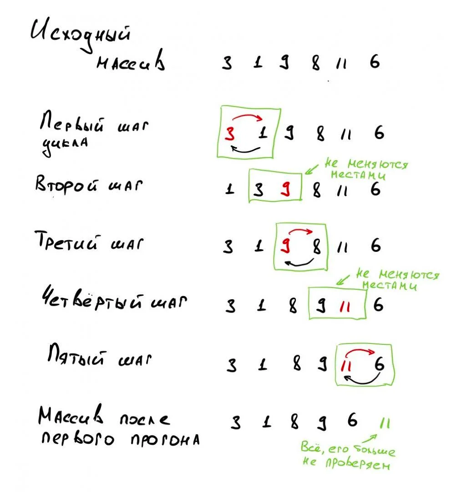

Реализуйте алгоритм сортировки пузырьком для сортировки массива

Принцип работы
На каждом шаге мы находим наибольший элемент из двух соседних и ставим этот элемент в конец пары. Получается, что при каждом прогоне цикла большие элементы будут всплывать к концу массива, как пузырьки воздуха — отсюда и название.

Алгоритм выглядит так:

1. Берём самый первый элемент массива и сравниваем его со вторым. Если первый больше второго — меняем их местами с первым, если нет — ничего не делаем.
2. Затем берём второй элемент массива и сравниваем его со следующим — третьим. Если второй больше третьего — меняем их местами, если нет — ничего не делаем.
3. Проходим так до предпоследнего элемента, сравниваем его с последним и ставим наибольший из них в конец массива. Всё, мы нашли самое большое число в массиве и поставили его на своё место.
4. Возвращаемся в начало алгоритма и делаем всё снова точно так же, начиная с первого и второго элемента. Только теперь даём себе задание не проверять последний элемент — мы знаем, что теперь в конце массива самый большой элемент.
5. Когда закончим очередной проход — уменьшаем значение финальной позиции, до которой проверяем, и снова начинаем сначала.
6. Так делаем до тех пор, пока у нас не останется один элемент.

